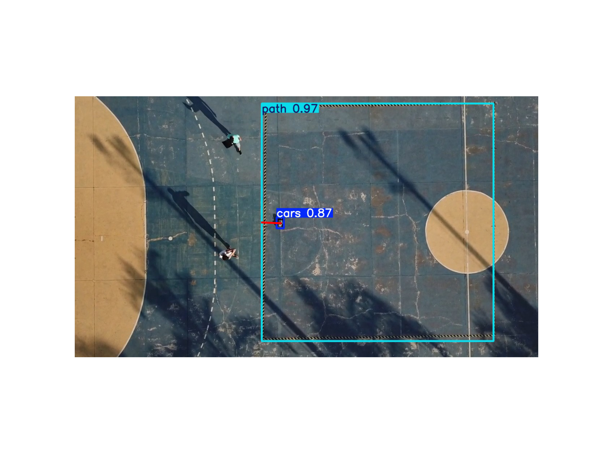

<!-- # path-follower-robot
Desenha-se o trajeto em uma interface web e o robô segue a trajetória desenhada.

* [Ensaio 1](https://youtu.be/cj4z1ridE08)
* [Ensaio 2](https://youtu.be/_qWvqBL0OQY)
* [Ensaio 3](https://youtu.be/jRkqLKHnnJs)

Link para o [artigo](https://biblioteca.inatel.br/cict/acervo%20publico/Sumarios/Artigos%20de%20TCC/TCC_Gradua%C3%A7%C3%A3o/Engenharia%20de%20Controle%20e%20Automa%C3%A7%C3%A3o/2024/Sistema%20de%20Controle%20Interativo.pdf) (PT-BR)

Artigo traduzido e publicado no Congresso Internacional ICCMA 2025 (IEEE), realizado em Paris (França). -->

## Interactive Control System for AGVs 🤖🛰️

This repository contains the integrated system and experimental source code for an autonomous robot (AGV) capable of following trajectories from DXF/SVG maps using **Arduino**, **Flask**, and **YOLOv8** computer vision analysis.

## 🎓 Scientific Publication
This project is part of the research presented at the 2025 13th International Conference on Control, Mechatronics and Automation (ICCMA) in Paris, France.

* **Title**: Interactive Control System for Automated Guide Vehicles

* **Authors**: HENRIQUES, J. P. C.; TEIXEIRA, D. N.; ROSA, M. B. M.; RIBEIRO, M. J. A.; RAIMUNDO NETO, E.; ARAGAO, M. V. C.; PAIVA, J. P. M. P.

* **Journal**: [Read the full paper on IEEE Xplore](https://ieeexplore.ieee.org/document/11369532)

---

## 🛠️ System Architecture

The project is divided into three main modules:

1.  **Firmware (Arduino):** Low-level control using C++ to manage robot actuators and sensors.
2.  **Web Server (Python/Flask):** A dashboard to upload maps, define paths, and start/stop the robot.
3.  **Vision & Analytics (YOLO/Matplotlib):** A post-processing pipeline that uses YOLOv8 to detect the robot and the path, calculating the **MSE** and **RMSE** of the execution.

---

## 📂 Project Structure

```text
├── arduino_code/
│   └── arduino_code.ino      # C++ Robot logic
├── python_web_server/
    ├── templates/              # HTML dashboards
    ├── static/                 # CSS/JS and generated graphs
│   ├── server.py               # Flask application
│   ├── data_sender.py          # Serial communication logic
│   ├── map_processing/         # DXF to SVG conversion
│   └── settings.yaml           # Global configurations
├── vision_module/
    ├── models/                 # YOLOv8 trained weights (.pt)
    ├── predict.py              # Inference script
    └── error_analysis.ipynb    # Accuracy metrics (MSE/RMSE)
```

---

## ⚙️ Installation

### Cloning the Repository

```bash
git clone https://github.com/miguel-jar/path-follower-robot.git
```

### Installing Required Packages

Install dependencies using your preferred method (conda or pip). **Python 3.11+** and **PyTorch 2.0+** are needed.

```bash
pip install -r requirements.txt
```

or

```bash
conda env create -f environment.yml
```

---

## 🖥️ Run

To run application, inside project folder, type:

```bash
cd python_web_server
python server.py
```

To run evaluations models, use a notebook interface (Jupyter Notebook, VS Code, Google Colab).

---

## 🧠 Dataset & Model Training

The training and testing datasets were generated from real-world footage of the project in operation. 

* **Source:** High-definition videos recorded with a drone during experimental runs.
* **Frame Extraction:** Images were sampled from these videos to create the training set for YOLOv8 (Standard and OBB models).
* **Video Links:** You can find the original footage used for data extraction here:
    * [Experiment Run #1](https://youtu.be/cj4z1ridE08)
    * [Experiment Run #2](https://youtu.be/_qWvqBL0OQY)
    * [Experiment Run #3](https://youtu.be/jRkqLKHnnJs)

---

## 📊 Performance Analysis & Vision Pipeline

### Data Acquisition

The analysis starts with high-definition footage recorded during the robot's operation. These videos (available on YouTube) serve as the primary data source. Frames are extracted and processed through the YOLOv8 model to pinpoint the robot's location relative to the trajectory in every frame.

### Accuracy Metrics

By comparing the detected coordinates against the ideal path generated from the maps, the system calculates the following statistical metrics to quantify precision:

* Mean Squared Error (MSE): Quantifies the average squared variance between the robot's center and the target path. This metric penalizes larger deviations, making it ideal for identifying critical path failures.

* Root Mean Squared Error (RMSE): Represents the standard deviation of the residuals. It provides the final error margin in a human-readable format: Centimeters (CM).

### Vision-to-Physical Calibration

To ensure real-world accuracy, the system uses a calibration constant based on the known width of the path ($1000$ cm), allowing the software to convert pixel-based detections into precise metric measurements.

### YOLOv8 Detection Example
To calculate the error metrics, the vision system performs real-time inference on the video frames. Below is an example of the model identifying the robot's orientation and its alignment with the path:

<div align="center">
  
  <p><i>Figure 1: YOLOv8 inference showing Class 0 (Robot) and Class 1 (Path).</i></p>
</div>